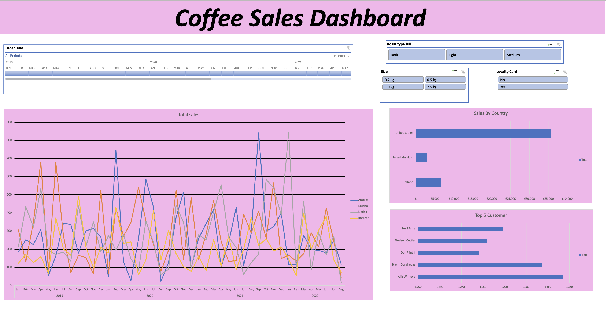

# Excel-Project-Coffee-Sales-Analysis

# ☕ Coffee Sales Analysis

## 📚 About the Data
This project uses an integrated coffee bean sales dataset spanning **three years** from 2019 to 2021 across the **US, UK, and Ireland**.

- **Orders**: Transaction logs including Order ID, Date, and Quantity  
- **Customers**: Profiles with names, locations (US, UK, Ireland), and loyalty status  
- **Products**: Bean types (Arabica, Robusta, Excelsa, Liberica) with pricing details  

---

## 📊 Project Dashboard
Here’s a snapshot of the interactive dashboard I built:

---

## 💡 Highlights
- **Interactive Dashboard**: Dynamic line chart showing total sales over time, split by coffee bean type  
- **Regional Performance**: Sales breakdown by country (US, Ireland, UK)  
- **Top 5 Customers**: Visuals representing highest-value clients  
- **Custom Filtering**: Slicers for roast type, package size, and loyalty card status  
- **Custom Timeline**: Filter all visuals by year and month  

---

## 🛠 How I Built This Project
1. **Data Gathering** – Collected and combined orders, customers, and product datasets using Excel lookups (`XLOOKUP`, `INDEX MATCH`).  
2. **Data Cleaning** – Handled missing values, standardized dates, and converted product codes to full names.  
3. **Data Transformation** – Built Excel Tables and applied logic-based formulas for automatic refresh.  
4. **Analysis & Modeling** – Created Pivot Tables to summarize sales by bean type, region, and customer.  
5. **Visualization** – Designed interactive Pivot Charts, slicers, and timelines to explore trends.  
6. **Insights & Highlights** – Identified top customers, regional trends, and overall sales performance.  

---

## 🛠 Tools Used
- **Data Gathering & Transformation**: Excel (`XLOOKUP`, `INDEX MATCH`, formulas, Tables)  
- **Analysis & Modeling**: Pivot Tables  
- **Visualization**: Pivot Charts, Slicers, Timelines  
